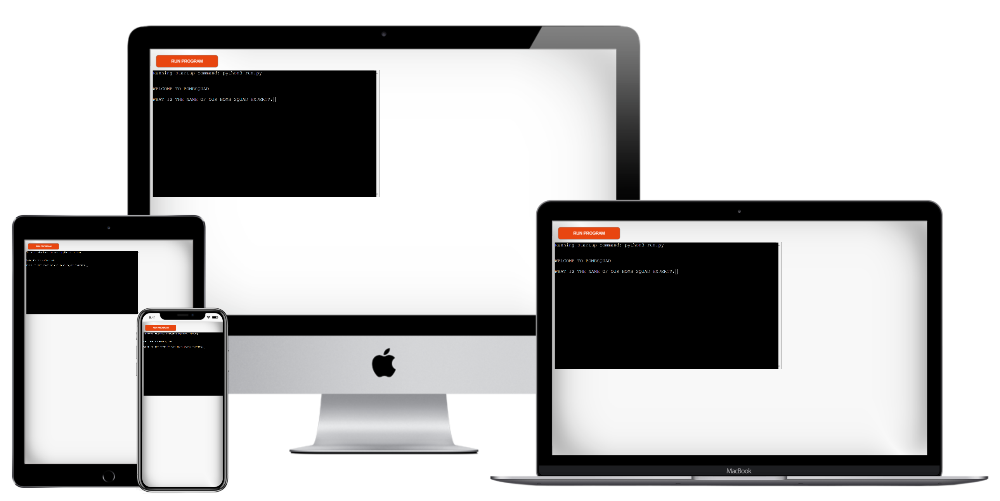
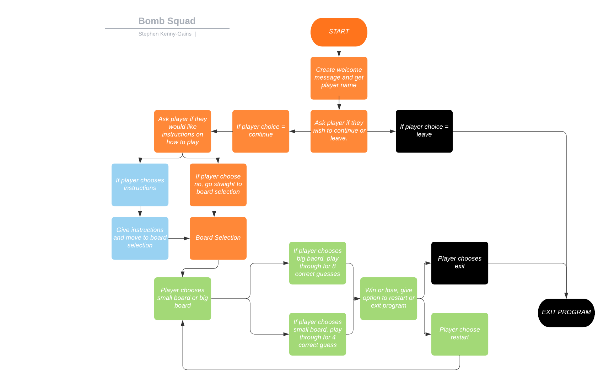
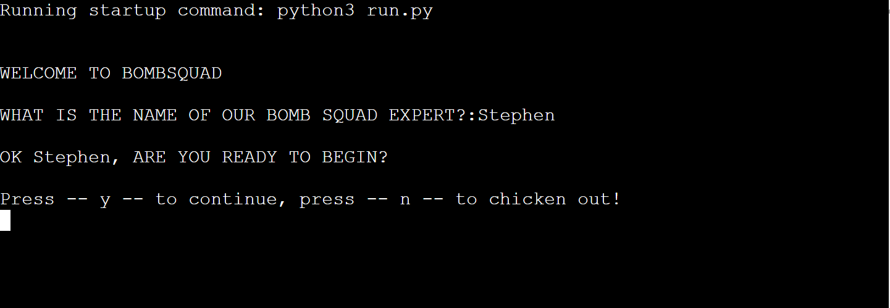
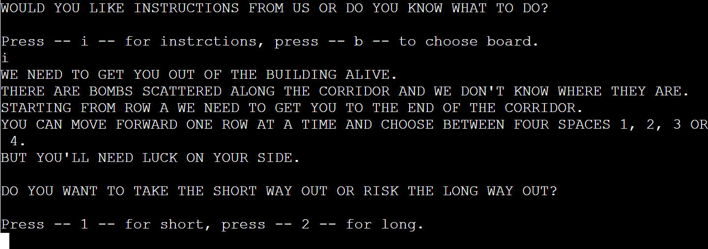
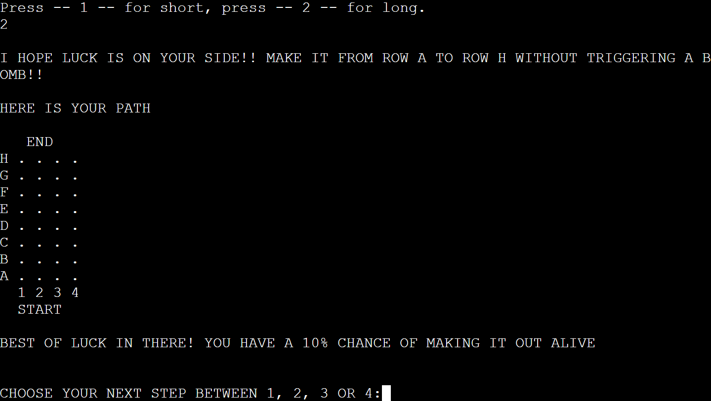
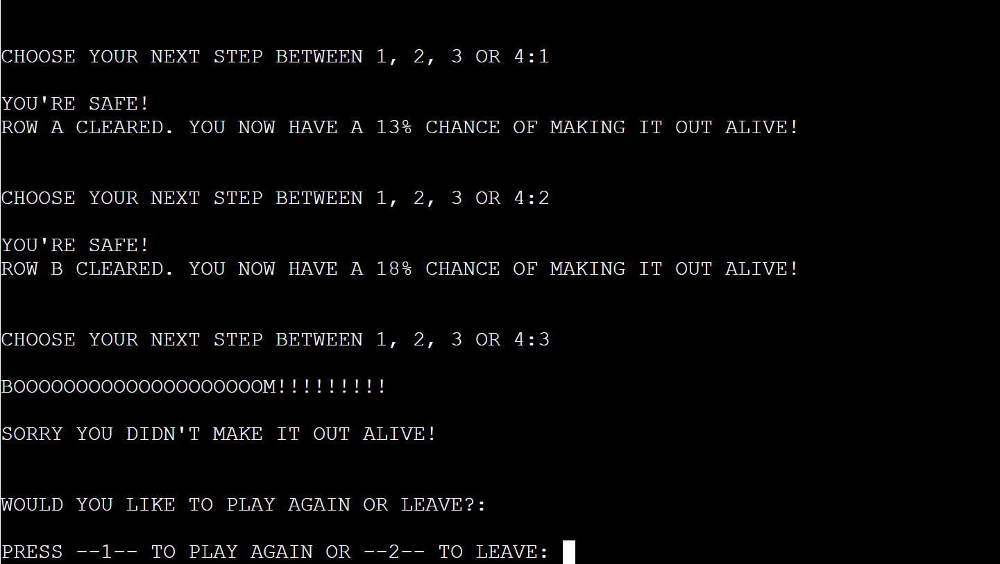

# BombSquad 

Bombsquad is a game of luck created from python to be exeuted through a terminal.

The layer will be given a corridor to navigate through made of four columns and varying row lenghts. 

The aim of the game is for the player to successfully get from one end of the corridor to the other without setting off a bomb which is hidden on each row.

To play through the game, click on the link below this mockup presentation.

## [View live website on Heroku](https://bombsquad-stephen.herokuapp.com/)
---

## Table of contents

- [UX](#ux)
    - [Site goals](#site-goals)
    - [User goals](#user-goals)
    - [Flowchart](#flowchart)
- [Features](#features)
    - [Existing Features](#existing-features)
    - [Features Left To Imlement](#features-left-to-implement)
- [Testing](#testing)
    - [Python](#python)
- [Code Validation](#validator-testing)
- [Unfixed Bugs](#unfixed-bugs)
- [Performance testing](#performance-testing)
- [Deployment](#deployment)
- [Credits](#credits)
- [Content](#content)
- [Media](#media)

## UX

## Site goals

Being a temrinal based program. There is very little design behind the page hosting the platform. Instead the emphasis for design has been put in to the content of the program itself. I have aimed to keep the program as easy to follow as possible while maintaining some element of user engagment and enjoyability. To make the game more engaging, I displayed the users probability of making it from one end of the hallway to the other with each correct guess, giving a sense of progression and achievement for beating the odds. The aim of this game is to have players test their luck and see how far that luck can carry them. The site is a demonstration of pythons programming capabilities for various usage. Given the low statistical chance of success through the more difficult game mode, the game offers a high re-playability.

## User goals:
- The user should feel that the program is easy to both run and understand.
- The user will be able to replay the game to test their luck in unfavouring odds.
- The player should find a sense of joy and achievement by successfully reaching the final stage.

## Flowchart

The flowchart for this program was made on LucidChart as recommended in the walkthrough project. The flowchart takes you through both the development strategy for the program and the user experiecne and where their options are to continue or exit the program and to be given additional instructions on the game along with difficulty choices.

## Features 

This game does not invlove around skill and instead invloves around luck. To create a better user experience I wanted to ensure I gave adequate options for both explaining the game or proceeding and to have the option of a short or long game. The reason for this is that since the game reveloves around luck over skill, by creating a 4 choice and an 8 choice playing board, the probability of success dramatically changes form each board. 

### Existing Features

- __User Prompt and Welcome__

  - The first stage to the program is basic with a simple message to welcome to the game with the title clearly displayed along with a prompt asking for the users name in an input field which is then relayed back to them in the following line. This is to show the user how the input function will work throughout the remainder of the game and to give them feedback to show them that their input is being received by the program.

- __Instructions__

  - The second feature is to give the option for instructions for the user or to proceed straight to board selection. Although new users may want some guidance on how to play, I wanted to leave the option available to a recurring player to bypass this stage and go straight to board selection.

- __Board Selection and Display__

  - The first prompt for the user to initiate the game is to choose the length of their game, choosing between a short path and a long path.
  - A different message will show to the user depending on their choice of board length to give a sense of the level of difficulty ahead.
  - When selected the baord will then display in a format that gives the player a more visual representation of the aim of the game showing 4 columns and either 4 or 8 rows depending on the user choice.
  - There is a start and an end displayed and the rows are lettered and columns numbered which are then relayed back to the user as they progress through the game. 

- __Board Run Through__

 - After the board has been selected the user now has inputs to be made to choose whether their next step will be 1, 2, 3 or 4 with the aim to choose a position with no hidden bomb. The initial message will also give them the probability percentage of them guessing correctly through the whole level.
 - If the player selects a position with a randomly allocated bomb, the display will show them BOOM and that they have died and give the option to try aain or exit the program.
 - If a player makes it through a stage, they will be given a new probability of making it to the end successfully and tell them they are safe.
 - Upon reaching the end the player is congratulted and given the choice to either play again or to exit the program.

 

### Features Left to Implement

- There are some features I have thought about including and have been relying on feedback from users as to whether they would improve the experience.
- The first would be to update the board display with each xtep for the user. To do this I would put the small and large board into a lit and then display the list to the user after each step to show them how many steps are left. This will left out originally to avoid over crowding the terminal but feel this could be avoided by clearing the terminal after each guess.
- The second feature to implement would be relaying back to the user their posiiton of death or executing a bomb on their previous turns. Although I did put this in as a feature in my initial development, I removed it after as I felt that on the long board play it could be detering to a user to see multiple failed attempts given how unlikely it is for a user to succeed throughthe long board. To get around this I would only diplay the most recent playthrough and offer one free skip of a row as an incentive to play again

## Testing 

### __Python__

- The only major issue I ran in to which took me a while to figure out was in the choose_row function, paired with the board_play functions. When this was set up, the code seemed to be working well and was giving correct failed attepts, correct attempts and playing through the baord length with the correct prompts. I then tested to see whether the function was working correctly when an invalid input was given. I had forgotten to implement this and was easily fixed with the not in synthax already used previously but there was still an issue.
- When an invalid input was given, the user was then getting a prompted that the guess was invalid but it was still registering it as a guess made. This meant that the user could just enter 4 or 8 invalid guesses and would sucessfully reach the end of game as the fcuntion was checking if the user guesses was less than the amount needed to pass through the game. I originally looked for the issue in the board_play functions and tried a few fixes which did not help and then rechecked the choose_row function. 
- I found that in the choose_row function I could pass 'guess' into the function as a parameter and then re call the choose_row(guess) function after an incorrect guess which solved the problem and no longer registered the guess as valid and so did not iterate through the fucntion as an attempt.
- Another minor issue was forgetting to use an =+ when iterating through the user guesses in the board_play functions and a was only using +. This was fixed after a quick revision of the iteration section of the course material.
- As I found the Github workspace to be slightly less convenient and wanted to test some different methods, I used Visual Studio Code on desktop for writing my code and then transferred this over to github at a later stage. I attempted to use the Guthub extension in VS Code but unfortuately my commits were not registering over to the repository I had made. I was also doing additional study to help understand my code better which was being done through VS Code. Credited below.
- After running the code through PEP8, there was a few trailing whitespaces and several lines which exceeded the charachter length allowed in python. These were easily rectified. 

### Validator Testing 

- Python
    - No errors were returned when passing through the official [PEP8](http://pep8online.com/) website. There were orininally some sytax errors which were corrected and are no longer present. 

## Unfixed Bugs

- There are no unfixed bugs at present.

## Performance Testing

The page was tested by friends to try and see if they could find any glaring issues with the program and to see if they could find a way to either break it or to bypass the functions to get to the end of the game and no issue shave yet been found. 

## Deployment 

- Ensure all code is correct and ready for deployment.
- Log into Heroku.
- Click "New" and select "create new app" from the drop-down menu. This is found in the upper right portion of the window.
- Provide a name for your application, this needs to be unique, and select your region.
- Click "Create App".
- Navigate to "Settings" and scroll down to "build packs".
- Click "build packs" and then click both "python" and "node.js"(node.js is needed for the mock terminal.)
- Ensure that the python buildpack is above the node.js buildpack, You can click and drag the packs to re-arrange them.
- Navigate to the "Deploy" section.
- Scroll down to "Deployment Method" and select "GitHub".
- Authorize the connection of Heroku to GitHub.
- Search for your GitHub repository name, and select the correct repository.
- For Deployment there are two options, Automatic Deployments or Manual.
- Automatic Deployment: This will prompt Heroku to re-build your app each time you push your code to GitHub.
- Manual Deployment: This will only prompt Heroku to build your app when you manually tell it to do so.
- Ensure the correct branch is selected "master/Main", and select the deployment method that you desire. In this case, I will be using Automatic Deployment.

## Credits 

 - Ardit Sulce- The Python Mega Course. I have not linked the site for this credit as I purchsed the course through StackSocial. I believe the original course loaction was through Udemy which was then sold onto StackSocial as a part of a developer learning bundle which I have found very helpful. Athough the course material from Code Institute does explain all the same methods which I used in my project, I personally struggle to use and grasp concepts if I do not understand exactly how and why a process is working. I found this course by Ardit Sulce very informative and helpful for helping me underastand the basic priciples for a lot of the code used in basic Python. The processes were broken down to a very simple level and is something I wish was done more in our own course material as I feel some information is given ina bit of a complex manner which is more aplliacable to those with more development experience. I will continue through the remainder of his course on building 10 real world applications to try and learn more on Python as I progress through the Code Institute material.

### Content 

- No additional content has been added to this site.

### Media

- No media has been used in the site and media in this file have been created myself.